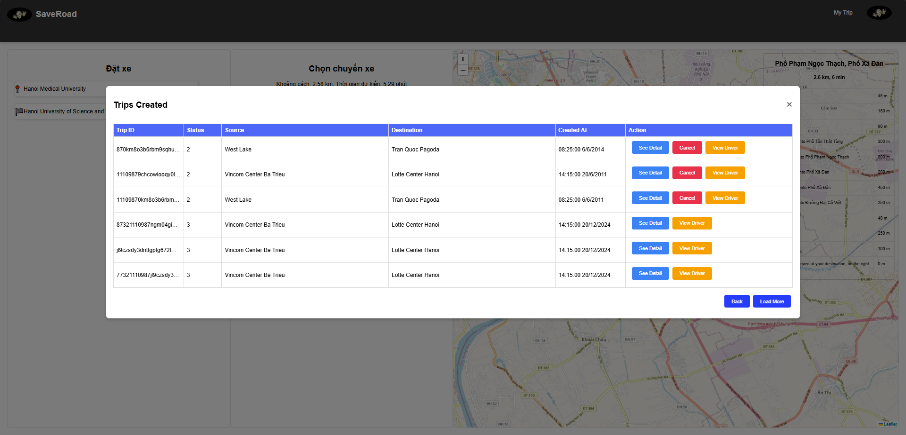

# Global Tracker Geo

## 📌 Overview
Global Tracker Geo is a ride-hailing platform designed to provide seamless transportation services for customers and drivers. It offers real-time tracking, ride management, and an intuitive interface for administrators to oversee the system efficiently.

## 🔧 Features

### 1. **Customer Features**
- Register, log in, and reset password.
- Select pickup and drop-off locations, create or cancel rides.
- Track driver location and ride status in real-time.
- Provide ratings and reviews after ride completion.

### 2. **Driver Features**
- Register, log in, and reset password.
- Accept or cancel ride requests, update ride status.

### 3. **Administrator Features**
- View analytics and statistics: dashboards with insights by year, month, and day.
- Manage customers and drivers: add, edit, or remove accounts.
- Add, edit, delete, and update vehicle types, promo codes, and notifications.
- Monitor real-time locations of all drivers.

## 🛠️ Tech Stack
- **Backend**: Java Spring
- **Frontend**: React.js, CSS.
    > Reference: **[Frontend](https://github.com/Moriarty178/GeoGlobalTracker-Frontend)**
- **Database**: PostgreSQL
- **Containerization**: Docker
- **Real-time Communication**: WebSocket for live driver tracking

## 📸 Screenshots

### 🏠 Customer Interface

| UI Screens                                                    | Order & Payment                                        | Order Success                                             |
|---------------------------------------------------------------|--------------------------------------------------------|-----------------------------------------------------------|
|                    |  |  |
| **Order History**                                             | **Order Rating**                                       | **Order Tracking**                                        |
|  |            |    |              

---

### 🔧 Administrator Interface

| Dashboard & Reports                                      | Driver & Rider Management                    | Notifications & Promo Codes                             |
|----------------------------------------------------------|----------------------------------------------|---------------------------------------------------------|
|                   |  |  |
| **Payment Reports**                                      | **Rider Management**                         | **Promo Code Management**                               |
|  |               |                |

---

### 🚖 Driver Interface

| Order Management                                | Order History                                     | Complete Order                                   |
|-------------------------------------------------|---------------------------------------------------|--------------------------------------------------|
|  |  |  |

---

# Authors
- [@Moriarty178](https://github.com/Moriarty178)
